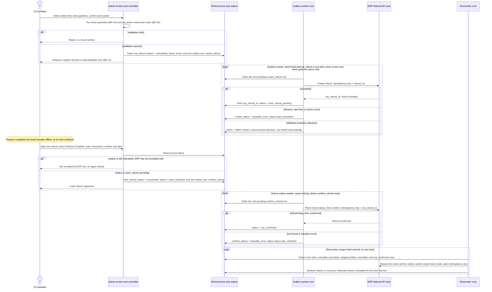

# 02 - Refund Design

My design of the end-to-end refund flow (sequence diagram) and my phased
delivery plan, built from the FRD.

## Sequence diagram

The admin request only ever touches the local database. Every call to the
ERP happens later, off a cron worker draining a database outbox, so the
operator is never waiting on the stub, and a slow or failing ERP can never
turn into a slow or failing admin screen. The reconciler is a second, slower
cron that sweeps anything left in a retryable state and gives it another
attempt, so the outbox worker does not have to be perfect for the flow to be
durable. The diagram stops short of the four presentation surfaces and the
downstream export, since those are read models built off the stored refund
snapshot once it exists (BR-11) and add no new failure boundary of their own.

Every ERP call in this diagram, whether from the outbox worker or the
reconciler, is keyed the same way the FRD specifies: `refund_no` for Create
Refund (BR-07), `erp_refund_id` for Confirm Refund (BR-08). That is what
makes it safe for a row to be picked up twice, whether from an at-least-once
outbox delivery or from the reconciler retrying something the worker already
half-finished; the ERP is expected to answer a repeat with the same result
rather than open a second credit note.

The worklist itself never calls the ERP. It only ever reads the status
columns that these two cron jobs write, so a refresh shows the current
server state and never a state the browser invented (Section 14).

## Delivery plan

The plan is organised as five phases, each ending on a gate the next phase
depends on. Epics inside a phase can run in parallel unless a dependency is
called out.

| Phase | Epic | Scope | Depends on | Acceptance gate |
| --- | --- | --- | --- | --- |
| 1. Foundation | Data model and ACL | `mp_refund`, `mp_refund_item`, `mp_refund_event` schema; refund role and its ACL resources (view, create, cash-register, retry, audit-log) | None | Schema installs cleanly on a fresh container; each ACL resource independently grants or denies its screen |
| 2. Create path | Eligibility and calculation | BR-01 through BR-04: order eligibility, the 7-day contractual window read from the delivery record, per-line quantity guard, server-side total | Phase 1 | An operator can build a full or partial refund against a seeded seller order and the grand total matches a hand-checked figure |
| 2. Create path | Submission and one-active-refund guard | Commit-before-notify (BR-06), the concurrency guard behind BR-05, refund entry screen | Eligibility and calculation | Two concurrent submissions against the same order produce exactly one `mp_refund` row in a load test |
| 2. Create path | ERP Create Refund integration | `ErpRefundClient`, tax-code payload mapping (Section 11), retry and business-code sub-status handling, event logging | Submission and one-active-refund guard | Create round-trips against the stub for the 2xx, timeout, 429, 5xx, and business-rejection cases; a repeated create with the same `refund_no` never opens a second credit note |
| 3. Settlement close-out | Cash-refund registration and worklist | Refund Complete action, transaction number and date capture, worklist grid and its statuses | ERP Create Refund integration | Refund Complete is blocked until create has succeeded, and registers cleanly against BR-10 |
| 3. Settlement close-out | Confirmation and reconciliation | The outbox worker's read-then-confirm step, idempotent confirm, and the reconciler as the backstop for anything left retryable | Cash-refund registration and worklist | A refund reaches `erp_confirmed` end to end against the stub, including one run where the outbox worker's attempt fails and the reconciler closes it instead |
| 4. Presentation and export | Customer-facing surfaces | Receipt PDF, order-details screen, order history, confirmation email, all reading the same stored snapshot | Eligibility and calculation (needs the snapshot, not settlement) | All four surfaces show the same pre-refund and refund-breakdown figures for one seeded partial refund |
| 4. Presentation and export | Downstream export | Canonical refund record through the standard order sync, fired once a refund reaches `erp_confirmed`, its terminal state | Confirmation and reconciliation | Exported record matches the stored snapshot for one refund at `erp_confirmed`; a refund still short of that state produces no export yet |
| 5. Hardening and go-live | Non-functional gate | Worklist first-page latency at the stated volume, audit-log completeness and redaction, retry-permission enforcement, a runbook for a stuck outbox worker or reconciler | All of the above | Worklist returns its first page inside 1.5 seconds against a 20,000-row seed; a full audit trail exists for one refund from creation to confirmation with no unredacted bank or credential data |
